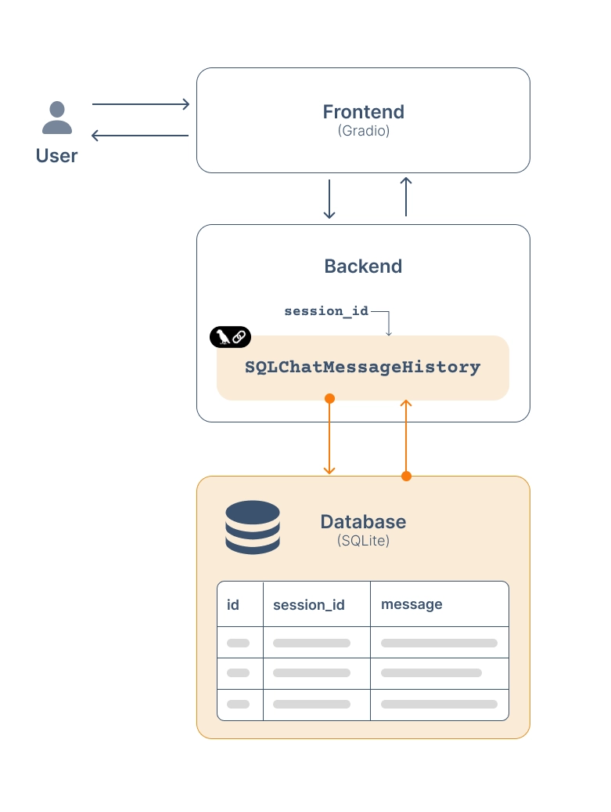

# Conversation history

Now let's tackle something that makes chatbots genuinely useful in production: conversation persistence.

Right now, if you refresh the page, your entire conversation is gone — it only lives in memory. Persistence solves this by saving every message to a database, so users can return to a conversation days later and pick up exactly where they left off.

LangChain makes this easy with **SQLChatMessageHistory** — a class that handles all the database operations for you: creating tables, storing messages, and loading them back. As you can see here, the architecture is clean:

- The frontend (Gradio) talks to the backend (your chatbot logic)
- The backend uses SQLChatMessageHistory with a session ID to read and write messages
- Everything gets persisted in a SQLite database

#### Quick recap SQL:

- A database is a structured way to store data that survives beyond your program's runtime — when the app restarts, the data is still there
- SQLite is the simplest flavor: a file-based database (just a .db file on disk), no server needed. Perfect for local development and lightweight apps
- SQL is the language used to query that data — e.g., SELECT, INSERT, DELETE

Now, here's how the persistence architecture works:

- Each conversation gets a unique session ID — a label that groups all messages belonging to that conversation
- SQLChatMessageHistory is LangChain's abstraction that handles all the SQL for you — you just tell it the session ID and connection string, and it reads/writes messages automatically
The message store is a table in SQLite with columns: session_id, message content, and metadata

The flow is: new conversation → generate session ID → messages saved automatically per turn → on return, load by session ID.

